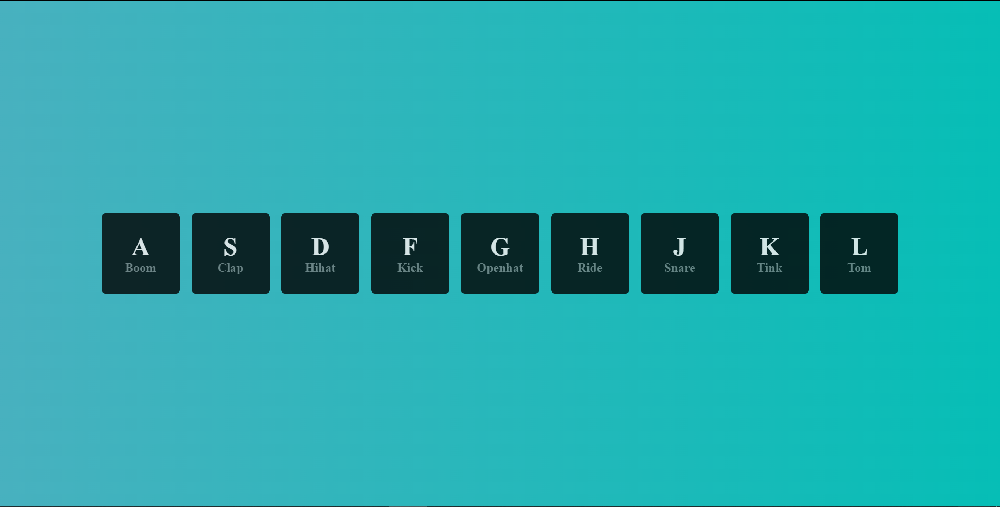

# Vanilla Js 30 Day Challenge - Day 1 Javascript Drum Kit Challenge

This is a solution to the Javascript Drum kit challenge.

## Table of contents

- [Overview](#overview)
  - [The challenge](#the-challenge)
  - [Screenshot](#screenshot)
  - [Links](#links)
- [My process](#my-process)
  - [Built with](#built-with)
  - [What I learned](#what-i-learned)
- [Author](#author)

## Overview

### The challenge

Users should be able to:

- Press the given keys on the keyboard out of which some keys are mapped to various sounds.
- Upon pressing the correct key, the sound should play.

### Screenshot



### Links

- [Solution URL](https://github.com/ManuKashyap01/Vanilla-JS-30-Day-Challenge)
- [Live Site URL](https://day-1-drum-kit.netlify.app/)

## My process

### Built with

- Semantic HTML5 markup
- JavaScript
- CSS custom properties
- Flexbox
- CSS Gradients


### What I learned

Javascript logic when user presses the key:

```
function playSound(e){
    const audio=document.querySelector(`audio[data-key="${e.keyCode}"]`);
    const key=document.querySelector(`.key[data-key="${e.keyCode}"]`);
    console.log(e)
    if(!audio) return;
    keys.forEach(key=>key.classList.remove('playing'))
    audio.currentTime=0;
    audio.play();
    key.classList.add('playing');
}
```

## Author

- Frontend Mentor - [@ManuKashyap01](https://www.frontendmentor.io/profile/ManuKashyap01)
- Github - [@ManuKashyap01](https://github.com/ManuKashyap01)
- Linkedin - [@manu-kashyap](https://www.linkedin.com/in/manu-kashyap/)
