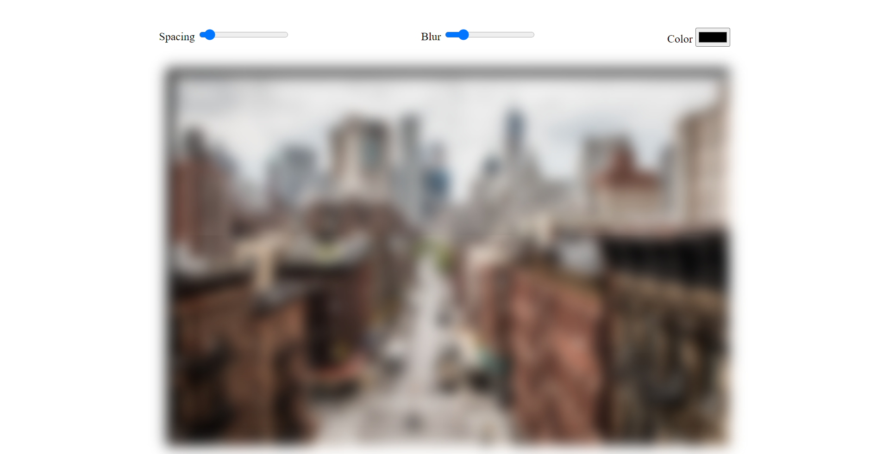

# Vanilla Js 30 Day Challenge - Day 2 CSS + JavaScript Clock Challenge

This is a solution to the Javascript Drum kit challenge.

## Table of contents

- [Overview](#overview)
  - [The challenge](#the-challenge)
  - [Screenshot](#screenshot)
  - [Links](#links)
- [My process](#my-process)
  - [Built with](#built-with)
  - [What I learned](#what-i-learned)
- [Author](#author)

## Overview

### The challenge

Users should be able to:

- Should be able to change the background color, spacing and blur of the image.
- input should be in the form of range

### Screenshot



### Links

- [Solution URL](https://github.com/ManuKashyap01/Vanilla-JS-30-Day-Challenge)
- [Live Site URL](https://day-3-css-variables-js.netlify.app/)

## My process

### Built with

- Semantic HTML5 markup
- JavaScript
- CSS custom properties
- Flexbox
- CSS variable


### What I learned

Javascript logic to handle the 'change' and 'mousemouse' event triggered on the inputs:

```
function update(){
    // here dataset is coming from html and sizing property is used as input is given attribut data-sizing='px'
    const suffix=this.dataset.sizing || '';
    document.documentElement.style.setProperty(`--${this.name}`,this.value+suffix)
}
```

## Author

- Frontend Mentor - [@ManuKashyap01](https://www.frontendmentor.io/profile/ManuKashyap01)
- Github - [@ManuKashyap01](https://github.com/ManuKashyap01)
- Linkedin - [@manu-kashyap](https://www.linkedin.com/in/manu-kashyap/)
