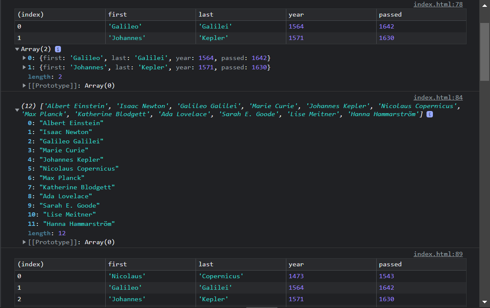
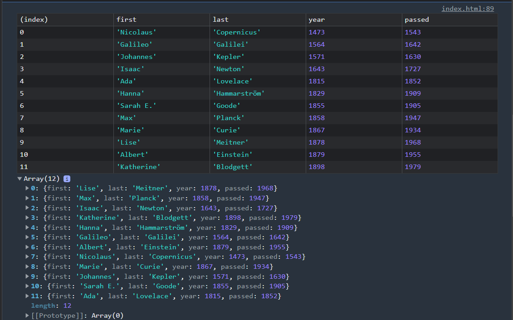
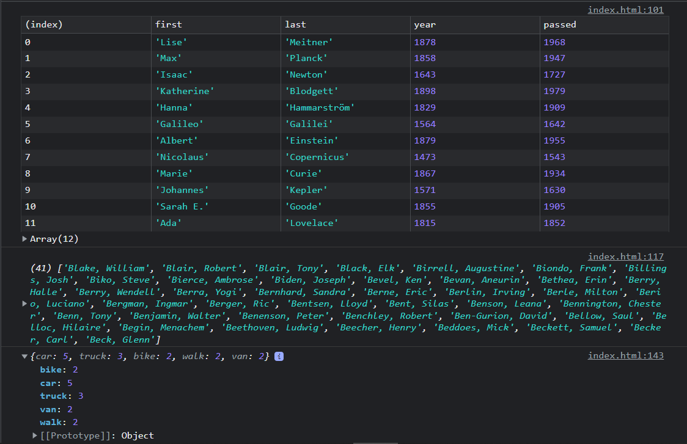

# Vanilla Js 30 Day Challenge - Day 4 Working with array methods in JavaScript Challenge

This is a solution to the Working with array methods in JavaScript challenge.

## Table of contents

- [Overview](#overview)
  - [The challenge](#the-challenge)
  - [Screenshot](#screenshot)
  - [Links](#links)
- [My process](#my-process)
  - [Built with](#built-with)
  - [What I learned](#what-i-learned)
- [Author](#author)

## Overview

### The challenge

Users should be able to:

- see the usage of different array methods of javascript

### Screenshot






### Links

- [Solution URL](https://github.com/ManuKashyap01/Vanilla-JS-30-Day-Challenge)

## My process

### Built with

- Semantic HTML5 markup
- JavaScript

### What I learned

Javascript logic to filter the list of inventors for those who were born in the 1500's using filter method
```
const fifteen = inventors.filter(
  (inventor) => inventor.year >= 1500 && inventor.year < 1600
);
```

Javascript logic to sort the inventors by birthdate, oldest to youngest using sort method
```
const ordered = inventors.sort((a, b) => (a.year > b.year ? 1 : -1));
```

Javascript logic to give us an array of the inventors first and last names using map method
```
const fullNames = inventors.map(
  (inventor) => `${inventor.first} ${inventor.last}`
);
```

Javascript logic to give us how many years did all the inventors live all together using reduce method
```
// 
const totalYears = inventors.reduce((total, inventor) => {
  return total + (inventor.passed - inventor.year);
}, 0);
```
## Author

- Frontend Mentor - [@ManuKashyap01](https://www.frontendmentor.io/profile/ManuKashyap01)
- Github - [@ManuKashyap01](https://github.com/ManuKashyap01)
- Linkedin - [@manu-kashyap](https://www.linkedin.com/in/manu-kashyap/)
