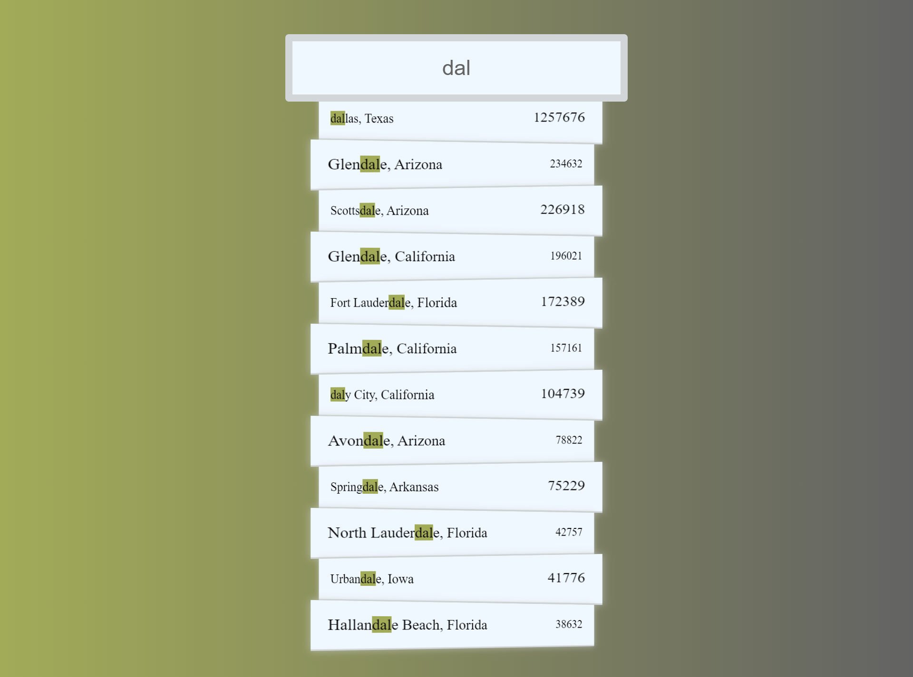

# Vanilla Js 30 Day Challenge - Day 6 AJAX type ahead Challenge

This is a solution to the Javascript Ajax type ahead challenge.

## Table of contents

- [Overview](#overview)
  - [The challenge](#the-challenge)
  - [Screenshot](#screenshot)
  - [Links](#links)
- [My process](#my-process)
  - [Built with](#built-with)
  - [What I learned](#what-i-learned)
- [Author](#author)

## Overview

### The challenge

Users should be able to:

- search for different cities or states using the prefix of either state or city
- the result should be displayed as soon as the input field is updated

### Screenshot



### Links

- [Solution URL](https://github.com/ManuKashyap01/Vanilla-JS-30-Day-Challenge)
- [Live Site URL](https://day-6-ajax-type-ahead.netlify.app/)

## My process

### Built with

- Semantic HTML5 markup
- JavaScript
- CSS custom properties
- Flexbox
- CSS gradients
- fetch API


### What I learned

Javascript logic to fetch data from the given endpoint:

```
fetch(endpoint)
    .then(blob=>blob.json())
    .then(data=>cities.push(...data));
```

Javascript logic to find the desired state or city using RegExp (regular expression)
```
function findMatches(wordToMatch,cities){
    return cities.filter(places=>{
        const regex=new RegExp(wordToMatch,'gi');
        return places.city.match(regex) || places.state.match(regex);
    });
}
```

Javascript logic to get make html for the list items from the filtered data
```
let html=matchArray.map(data=>{
        const regex=new RegExp(this.value,'gi');
        const cityName=data.city.replace(regex,`<span class="hl">${this.value}</span>`)
        const stateName=data.state.replace(regex,`<span class="hl">${this.value}</span>`)
        return `
        <li>
            <span>${cityName}, ${stateName}</span>
            <span class="pop">${data.population}</span>
        </li>
        `
    }).join('');
```
## Author

- Frontend Mentor - [@ManuKashyap01](https://www.frontendmentor.io/profile/ManuKashyap01)
- Github - [@ManuKashyap01](https://github.com/ManuKashyap01)
- Linkedin - [@manu-kashyap](https://www.linkedin.com/in/manu-kashyap/)
