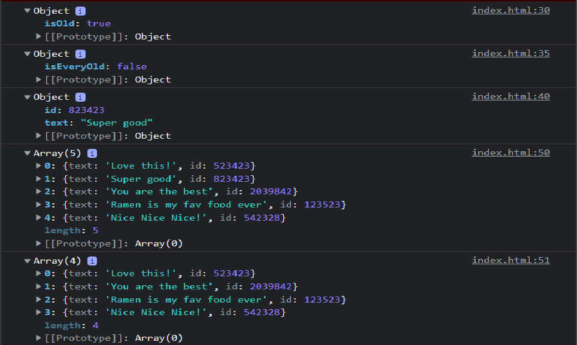

# Vanilla Js 30 Day Challenge - Day 7 working with array methods 2 Challenge

This is a solution to the Javascript - working with array methods 2 challenge.

## Table of contents

- [Overview](#overview)
  - [The challenge](#the-challenge)
  - [Screenshot](#screenshot)
  - [Links](#links)
- [My process](#my-process)
  - [Built with](#built-with)
  - [What I learned](#what-i-learned)
- [Author](#author)

## Overview

### The challenge

Users should be able to:

- see the developer's console to see the usage of different array methods

### Screenshot



### Links

- [Solution URL](https://github.com/ManuKashyap01/Vanilla-JS-30-Day-Challenge)

## My process

### Built with

- Semantic HTML5 markup
- JavaScript

### What I learned

Javascript logic to find a specific element in the array:

```
const comment = comments.find((c) => c.id == 823423);
```

Javascript logic to find index of a specific element in the array:

```
const comment = comments.findIndex((c) => c.id == 823423);
```

Javascript logic to remove an element at index
```
const newComms = [
    ...comments.slice(0, index),
    ...comments.slice(index + 1),
];
```
## Author

- Frontend Mentor - [@ManuKashyap01](https://www.frontendmentor.io/profile/ManuKashyap01)
- Github - [@ManuKashyap01](https://github.com/ManuKashyap01)
- Linkedin - [@manu-kashyap](https://www.linkedin.com/in/manu-kashyap/)
