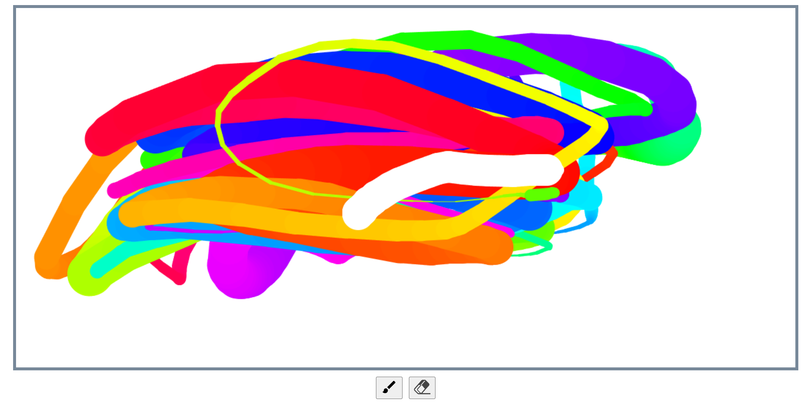

# Vanilla Js 30 Day Challenge - Day 8 HTML5 Canvas Challenge

This is a solution to the Javascript - HTML5 Canvas challenge.

## Table of contents

- [Overview](#overview)
  - [The challenge](#the-challenge)
  - [Screenshot](#screenshot)
  - [Links](#links)
- [My process](#my-process)
  - [Built with](#built-with)
  - [What I learned](#what-i-learned)
- [Author](#author)

## Overview

### The challenge

Users should be able to:

- draw on the HTML5 canvas, the stroke color and stroke width should change as the user draws on the canvas
- eraze the strokes from the canvas

### Screenshot



### Links

- [Solution URL](https://github.com/ManuKashyap01/Vanilla-JS-30-Day-Challenge)
- [Live URL](https://day-8-html-canvas.netlify.app/)

## My process

### Built with

- Semantic HTML5 markup
- JavaScript
- HTML5 canvas

### What I learned

Javascript logic to draw on HTML5 canvas:

```
function Draw(e){
    if(!isDrawing) return;
    ctx.strokeStyle=`hsl(${hue},100%,50%)`
    if(isRemove) {
        ctx.strokeStyle='#fff'
    }
    ctx.beginPath();
    ctx.moveTo(lastX,lastY);
    ctx.lineTo(e.offsetX,e.offsetY);
    ctx.stroke();
    [lastX,lastY]=[e.offsetX,e.offsetY];
    hue++;
    if(ctx.lineWidth>=75 || ctx.lineWidth<=1){
        isInc=!isInc;
    }
    if(isRemove) ctx.lineWidth=50
    else if(isInc) ctx.lineWidth++;
    else ctx.lineWidth--;
}
```
## Author

- Frontend Mentor - [@ManuKashyap01](https://www.frontendmentor.io/profile/ManuKashyap01)
- Github - [@ManuKashyap01](https://github.com/ManuKashyap01)
- Linkedin - [@manu-kashyap](https://www.linkedin.com/in/manu-kashyap/)
