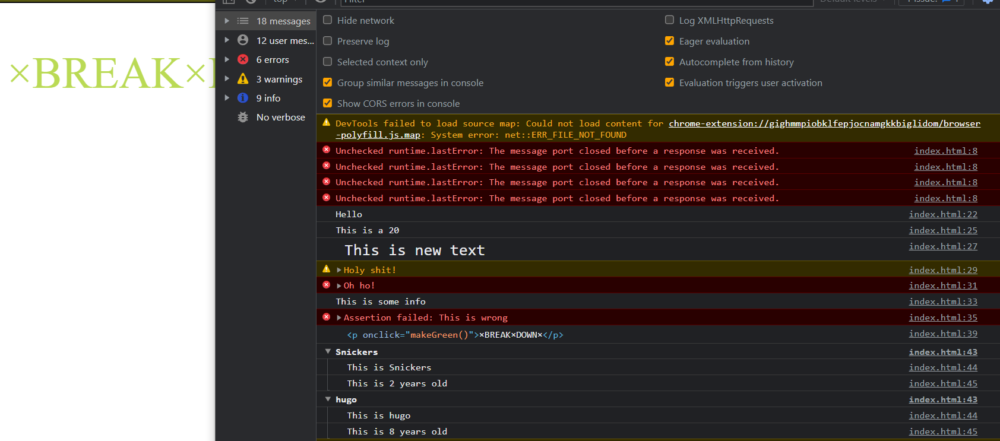

# Vanilla Js 30 Day Challenge - Day 9 Dev tools and tricks

This is a solution to the Dev tools and tricks.

## Table of contents

- [Overview](#overview)
  - [The challenge](#the-challenge)
  - [Screenshot](#screenshot)
  - [Links](#links)
- [My process](#my-process)
  - [Built with](#built-with)
  - [What I learned](#what-i-learned)
- [Author](#author)

## Overview

### The challenge

Users should be able to:

- view the result of different developer's tools and tricks

### Screenshot



### Links

- [Solution URL](https://github.com/ManuKashyap01/Vanilla-JS-30-Day-Challenge)

## My process

### Built with

- Semantic HTML5 markup
- JavaScript

### What I learned

Javascript console tricks to display different :

```
console.log(`This is a ${time}`);
// Styled
console.log("%c This is new text", "font-size:20px");
// warning!
console.warn("Holy shit!");
// Error :|
console.error("Oh ho!");
// Info
console.log("This is some info");
// Testing
console.assert(1 === "1", "This is wrong");

// Grouping together
dogs.forEach((dog) => {
  console.groupCollapsed(`${dog.name}`);
  console.log(`This is ${dog.name}`);
  console.log(`This is ${dog.age} years old`);
  console.groupEnd();
});
```
## Author

- Frontend Mentor - [@ManuKashyap01](https://www.frontendmentor.io/profile/ManuKashyap01)
- Github - [@ManuKashyap01](https://github.com/ManuKashyap01)
- Linkedin - [@manu-kashyap](https://www.linkedin.com/in/manu-kashyap/)
